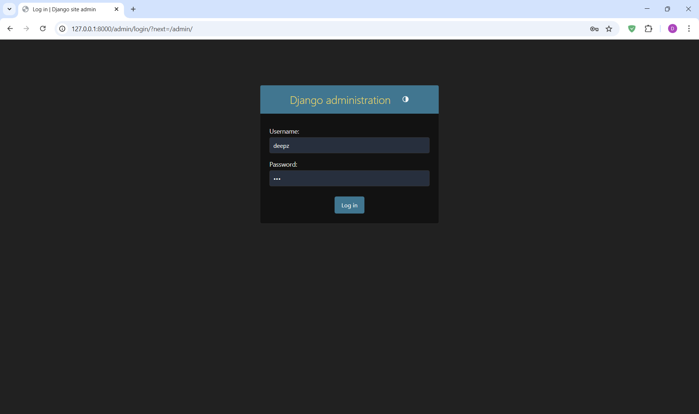
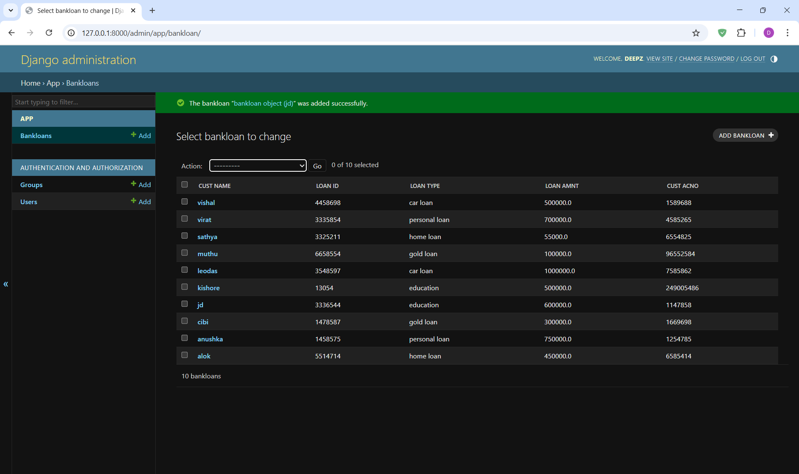

# Ex02 Django ORM Web Application
# Date:
# AIM
To develop a Django application to store and retrieve data from a bank loan database using Object Relational Mapping(ORM).

# ENTITY RELATIONSHIP DIAGRAM
## DESIGN STEPS
## STEP 1:
Clone the problem from GitHub

## STEP 2:
Create a new app in Django project

## STEP 3:
Enter the code for admin.py and models.py

## STEP 4:
Execute Django admin and create details for 10 books

# PROGRAM


```
admins.py

from django.contrib import admin
from.models import bankloan,bankloanAdmin


admin.site.register(bankloan,bankloanAdmin)
```

```
models.py 

from django.db import models
from django.contrib import admin
class bankloan(models.Model):
    cust_name=models.CharField( max_length=50,primary_key=True)
    loan_ID=models.IntegerField()
    loan_type=models.CharField(max_length=50)
    loan_amnt=models.FloatField()
    cust_acno=models.IntegerField()
           
# Create your models here.
class bankloanAdmin(admin.ModelAdmin):
           list_display = ('cust_name','loan_ID','loan_type','loan_amnt','cust_acno')


```
# OUTPUT





# RESULT
Thus the program for creating a database using ORM hass been executed successfully
